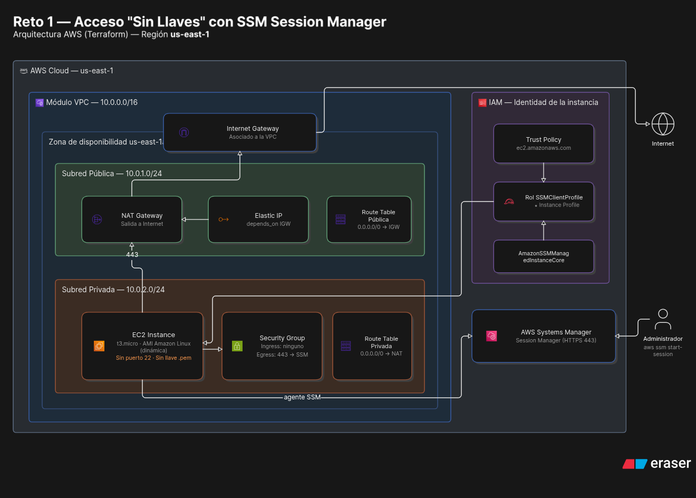

# Challenge
### Challenge 1: "Keyless" Access (SSM Session Manager)

This is the modern industry standard. The goal is to eliminate the use of SSH keys (`.pem`) and port 22.

* **The Scenario:** Create an EC2 instance in a private subnet (without direct internet access).

* **The Challenge:**

1. Create an IAM Role for the EC2 instance that allows it to communicate with the **SSM (Systems Manager)** service.

2. Configure the instance so that port 22 is not open in its Security Group.

3. Successfully access the instance's terminal using the AWS console or the `aws ssm start-session` command.

# Step-by-Step Solution
Solution to the challenge implemented using Terraform.

## VPC Module
### Requirements
* VPC
* Internet Gateway
* NAT Gateway
* Subnets
* Route Tables
* Elastic IP

### Implementation Details
#### VPC
* *CIDR Block*: 10.0.0.0/16
* Region: us-east-1
#### Subnets
* Public: 10.0.1.0/24
* Private: 10.0.2.0/24
* Availability Zone: us-east-1a (both)
#### Internet Gateway
* Must be associated with the VPC
#### Elastic IP
* Must be associated with the VPC
* Must depend on the Internet Gateway implementation
#### Route Tables
* Public: Must be associated with the VPC and have a route to "0.0.0.0/0" pointing to the Internet Gateway
* Private: Must be associated with the VPC and have a route to "0.0.0.0/0" pointing to the NAT Gateway
* Both tables must be associated with their respective subnets (public and private)

## Solution with the Implemented Module
A folder structure for Terraform based on environments should be used. The solution will be designed for the local environment.

### Requirements
* Policies
* Role
* Profile
* Operating System AMI
* Security Group
* EC2 Instance

### Details
#### Policies
* Trust Policy: Must allow the role to be assumed only by EC2 instances
* Permission Policy: Must allow EC2 instances to communicate with SSM Session Manager, directly use the AmazonSSMManagedInstanceCore policy
#### Roles
* The role name must be SSMClientProfile
* Associate who can assume the role with the Trust Policy
* Associate the role with the Permission Policy
#### AMI
* Implement dynamic capture of the Amazon AMI for the EC2 instance
#### Security Group
* Allow outbound traffic for communication with SSM (Port 443) from the EC2 instance
#### EC2 Instance
* The EC2 instance is unique
* Instance Type: t3.micro
* Associate the instance with:
	* Captured AMI ID
	* Private subnet ID
	* Security Group ID

# Expected Diagram

