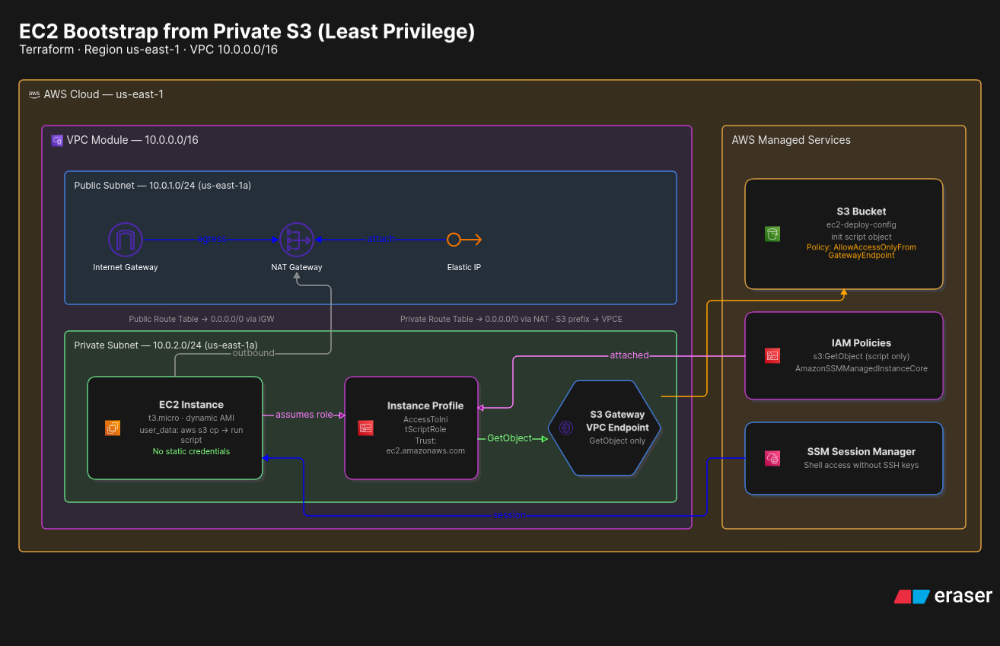

# Challenge
### Challenge 2: The “Automatic Installer” (User Data + S3)
It is very common for a server to need to download its code or configuration upon startup.

*   **The Scenario:** You have an installation script stored in a private S3 bucket.
*   **The Challenge:**
    1.  Create a role that only allows `s3:GetObject` on that specific script.
    2.  Use the `user_data` field in Terraform so that, upon startup, the EC2 instance downloads the script and runs it automatically.
    3.  Verify that the EC2 instance **does not** have AWS credentials stored in text files, but instead uses the role.
*   **What You’ll Practice:**
    *   Trust flow between EC2 and S3.
    *   Bootstrapping.
    *   The principle of least privilege applied to S3 objects.
Analiza el document e implementa el diagrama de la arquitectura AWS que se detalla a partir de la seccion "Solucion Paso a Paso"
# Step-by-Step Solution
Solution to the challenge implemented using Terraform.
## VPC Module
### Requirements
* VPC
* Internet Gateway
* NAT Gateway
* Subnets
* Route Tables
* Elastic IP

### Implementation Details
#### VPC
* *CIDR Block*: 10.0.0.0/16
* Region: us-east-1
#### Subnets
* Public: 10.0.1.0/24
* Private: 10.0.2.0/24
* Availability Zone: us-east-1a (both)
#### Internet Gateway
* Must be associated with the VPC
#### Elastic IP
* Must be associated with the VPC
* Must depend on the Internet Gateway implementation
#### Route Tables
* Public: Must be associated with the VPC and have a route to "0.0.0.0/0" pointing to the Internet Gateway
* Private: Must be associated with the VPC and have a route to "0.0.0.0/0" pointing to the NAT Gateway
* Both tables must be associated with their respective subnets (public and private)

## Solution with VPC Module
A folder structure for Terraform based on environments should be used. The solution will be designed for the local environment.

### Requirements
* S3 Bucket
* Policies
* Role
* Profile
* EC2 Instance
* VPC Endpoint

### Details
#### S3 Bucket
* Name: "ec2-deploy-config"
* Policy: Access to objects in the bucket should be allowed only when the request originates from a VPC endpoint (gateway endpoint). The policy should be named “AllowAccessOnlyFromGatewayEndpoint.”
* Script File: The script must be upload to the bucket 
#### Policies
* Trust Policy: Must allow the role to be assumed only by EC2 instances
* Permission Policy: Must allow EC2 instance to communicate with SSM Session Manager, use the AmazonSSMManagedInstanceCore policy and must allow only GET request for the init script from the bucket
#### Roles
* The role name must be AccessToInitScriptRole
* Associate who can assume the role with the Trust Policy
* Associate the role with the Permission Policy
#### AMI
* Implement dynamic capture of the Amazon AMI for the EC2 instance
#### EC2 Instance
* The EC2 instance is unique
* Instance Type: t3.micro
* Associate the instance with:
	* Captured AMI ID
	* Private subnet ID
* The EC2 instance must use the `user_data` input parameter to retrive the script from the bucket using the aws cli and run it.
### VPC Endpoint
* Must be unique
* Must be a type `gateway`
* There must be a route association between the private route of the “VPC module" and the "VPC endpoint" (gateway).
* There must be a permission policy that allows only `GetObjects` operation from the bucket
  
# Expected Diagram

